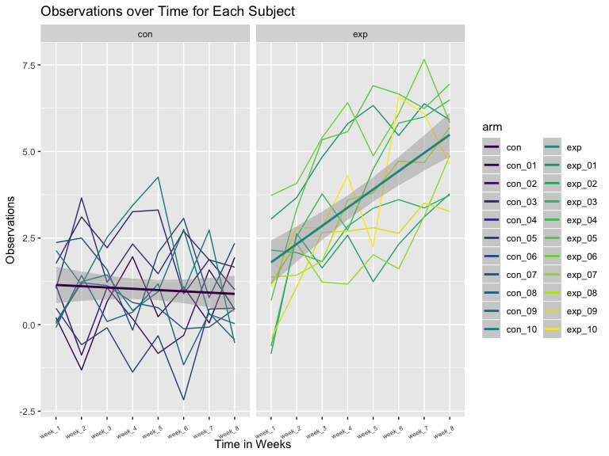
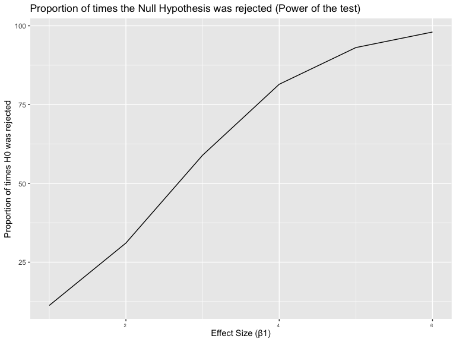
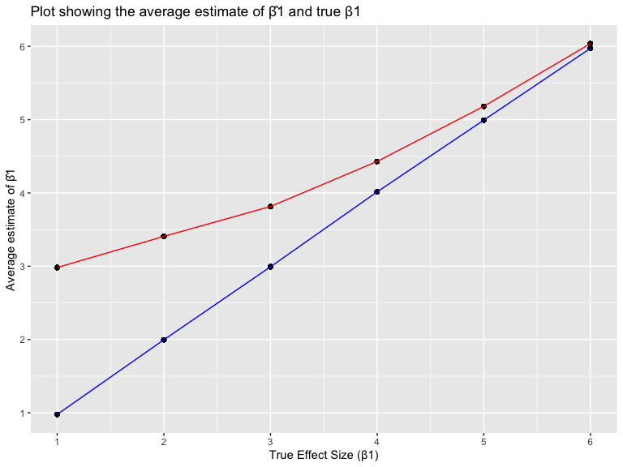

P8105\_hw5\_yc384
================
Ying Chen (UNI: yc384)
11/5/2019

## Problem 1: The purpose of this problem is to fill in those missing values.

  - For numeric variables, replace missingness with the mean of
    non-missing values
  - For character variables, fill in missing values with “virginica”

In following code chunk, I wrote a function called
“iris\_missingreplaced”, which takes a vector as an argument; replaced
missing values using the rules defined above; and returns the resulting
vector. At the end, I applied this function to the columns of
iris\_with\_missing using a map statement and saved the data as output.

``` r
# Read in data
iris_with_missing = iris %>% 
  map_df(~replace(.x, sample(1:150, 20), NA)) %>%
  mutate(Species = as.character(Species))
```

``` r
iris_missingreplaced = function(m) {
  
  if (is.numeric(m)) {
   replace_na(m, mean(m, na.rm = TRUE))
   }
   else if (is.character(m)) {
     replace_na(m, "virginica")
  } 
}

output = map_df(iris_with_missing, iris_missingreplaced)
output
```

    ## # A tibble: 150 x 5
    ##    Sepal.Length Sepal.Width Petal.Length Petal.Width Species
    ##           <dbl>       <dbl>        <dbl>       <dbl> <chr>  
    ##  1         5.1          3.5         1.4         0.2  setosa 
    ##  2         4.9          3           1.4         0.2  setosa 
    ##  3         4.7          3.2         1.3         0.2  setosa 
    ##  4         4.6          3.1         1.5         1.19 setosa 
    ##  5         5            3.6         1.4         0.2  setosa 
    ##  6         5.4          3.9         1.7         0.4  setosa 
    ##  7         5.82         3.4         1.4         0.3  setosa 
    ##  8         5            3.4         1.5         0.2  setosa 
    ##  9         4.4          2.9         1.4         0.2  setosa 
    ## 10         4.9          3.1         3.77        0.1  setosa 
    ## # … with 140 more rows

``` r
skimr::skim(output)
```

    ## Skim summary statistics
    ##  n obs: 150 
    ##  n variables: 5 
    ## 
    ## ── Variable type:character ─────────────────────────────────────────────────────
    ##  variable missing complete   n min max empty n_unique
    ##   Species       0      150 150   6  10     0        3
    ## 
    ## ── Variable type:numeric ───────────────────────────────────────────────────────
    ##      variable missing complete   n mean   sd  p0  p25  p50  p75 p100
    ##  Petal.Length       0      150 150 3.77 1.6  1   1.7  4    4.97  6.9
    ##   Petal.Width       0      150 150 1.19 0.72 0.1 0.4  1.2  1.8   2.5
    ##  Sepal.Length       0      150 150 5.82 0.78 4.3 5.12 5.82 6.38  7.9
    ##   Sepal.Width       0      150 150 3.08 0.4  2   2.82 3.08 3.27  4.4
    ##      hist
    ##  ▇▁▁▆▆▆▃▁
    ##  ▇▁▁▇▃▃▂▂
    ##  ▂▆▃▇▃▃▁▁
    ##  ▁▂▃▇▂▂▁▁

**Comments:** Summary and output data showed the imputation of missing
data was
successful.

## Problem 2: Make spaghetti plot showing observations on each subject over time by arm

#### Load the data using the code chunk below:

``` r
files = list.files("./data", full.names = TRUE)
data = map_df(files, read_csv)
```

#### Then tidy the data

``` r
df = 
  data_frame(files) %>% 
  bind_cols(data) %>% 
  mutate(arm = substr(files, 8, 10),
         subject_ID = substr(files, 8, 13)) %>% 
  pivot_longer(week_1:week_8,
               names_to = "week",
               values_to = "obs") %>% 
  mutate(week = as.factor(week)) %>% 
  select(-files)
```

#### Finally, we make a spaghetti plot showing observations on each subject over time

``` r
plot1 = 
  df %>% 
  ggplot(aes(x = week, y = obs, group = subject_ID, color = arm)) +
  geom_line(aes(color = subject_ID)) + 
  stat_smooth(
    aes(group = 1),
    method = "lm"
    ) +
  labs(title = "Observations over Time for Each Subject",
       x = "Time in Weeks",
       y = "Observations") + 
  theme(axis.text.x = element_text(hjust = 0.8, vjust = 0.5, size = 6, angle = 25)) +
  facet_grid(. ~arm) 

plot1
```



**Comments:** From the spaghetti plot, we can see that the weekly
observation for the experiment group increases as time increases; while
the control arm decreased slightly overtime. Differenc in observation
values between control and experiment groups increases overtime. The
minimum value for the experiment group at week 8 is greater than the
maximum value of the control group, which indicates the oberseved value
at week 8 differs significantly between the two
groups.

## Problem 3: In this problem, conduct a simulation to explore power in a simple linear regression.

#### First define the regression function as follows:

  - Fix n=30, xi1 ~ as draws from a standard Normal distribution
  - Fix β0=2, σ2=50, β1=0
  - Generate 10000 datasets from the model: yi=β0+β1xi1+ϵi, with
    ϵi∼N\[0,σ2\]
  - For each dataset, used broom::tidy to clean output of lm and save
    β̂1 and the p-value arising from a test of H:β1=0, using α=0.05

<!-- end list -->

``` r
sim_regression = function(n=30, beta0 = 2, beta1 = 0, sigma = sqrt(50))
{
  sim_data = tibble(
    xi1 = rnorm(n, mean = 0, sd = 1),
    yi = beta0 + beta1 * xi1 + rnorm(n, 0, sigma)
  )
  
  ls_fit = lm(yi ~ xi1, data = sim_data)
  
  tibble(
    beta0_hat = broom::tidy(ls_fit)$estimate[1],
    beta1_hat = broom::tidy(ls_fit)$estimate[2],
    p_value = broom::tidy(ls_fit)$p.value[2]
  )
}
```

#### Do the simulation:

``` r
sim_results = 
rerun(10000, sim_regression()) %>% 
  bind_rows 

sim_sig =
  sim_results %>% 
  mutate(significant_p = as.numeric(p_value<0.05))
```

#### Repeat the above for β1={1,2,3,4,5,6},

``` r
sim_results_beta1s = 
  tibble(beta1s = c(1,2,3,4,5,6)) %>% 
  mutate(
    output_list = map(.x = beta1s, ~rerun(10000, sim_regression(beta1 = .x))),
    estimate_dfs = map(output_list, bind_rows)
  ) %>% 
  select(-output_list) %>% 
  unnest(estimate_dfs) %>% 
  mutate(sig_p = as.numeric(p_value<0.05))
```

#### Make a plot showing the proportion of times h0 was rejected (the power of the test) on the y axis and the true value of β1 on the x axis. Describe the association between effect size and power.

``` r
sim_beta1s =
  sim_results_beta1s %>% 
  group_by(beta1s,sig_p) %>% 
  count() %>% 
  ungroup() %>% 
  group_by(beta1s) %>% 
  mutate(pct = (n / sum(n)*100)) 

plot2 = 
sim_beta1s %>% 
  filter(sig_p == 1) %>% 
  ggplot(
    aes(x = beta1s, y = pct)) +
    geom_line()+
    labs(title = "Proportion of times the Null Hypothesis was rejected (Power of the test)",
       x = "Effect Size (β1)",
       y = "Proportion of times H0 was rejected") + 
  theme(axis.text.x = element_text(hjust = 0.8, vjust = 0.5, size = 6)) 

plot2
```



**Comment:** From the above plots, we can see that power increases as
the effect size gets larger. In another word, it is easier to detect a
larder effect size in
general.

#### Make a plot showing the average estimate of β̂1 on the y axis and the true value of β1 on the x axis. Make a second plot (or overlay on the first) the average estimate of β̂1 only in samples for which the null was rejected on the y axis and the true value of β1 on the x axis.

``` r
average = 
sim_results_beta1s %>% 
  group_by(beta1s) %>% 
  mutate(
    mean_b1hat = mean(beta1_hat)
  ) 

  average %>% 
    filter(sig_p == 1) %>% 
    group_by(beta1s) %>% 
    mutate(mean_b1hat = mean(beta1_hat))  %>% 
    ggplot(
    aes(x = beta1s, y = mean_b1hat)) +
    geom_point()+
    geom_line(color = "Red", colour="Significant sample")+
    geom_point(data=average, fill = "Blue")+
    geom_line(data=average, color = "Blue", colour="Whole sample") +
    labs(title = "Plot showing the average estimate of β̂1 and true β1 ",
       x = "True Effect Size (β1)",
       y = "Average estimate of β̂1")+
    scale_x_continuous(breaks = c(0,1,2,3,4,5,6))+
    scale_y_continuous(breaks = c(0,1,2,3,4,5,6)) +
    guides(col = guide_legend)
```



#### Is the sample average of β̂1 across tests for which the null is rejected approximately equal to the true value of β1? Why or why not?

**Comments** From the above plot we can see that the sample average of
all β̂1 is approximately equal to the true β1 value (blue line). While
the average of β̂1 for the null is rejected sample (red line) is not
equal to the true value of β1 when β1 is small, but approches closer to
the true β1 when the effect size is large.

This is becuase if the true effect size is large, it is easier to detect
and most of the times, the null hypothesis tests will be rejected. But
when the true effect size is small (β1 is close to 0), it is difficult
to detect and the chance of rejecting the null will be small and the
proportion of rejection will be lower. Therefore, the average of β̂1 in
the two samples differs the most when the true effect size is close to
0. This difference is also caused by selecting only the significant
results that had larger β̂1s.
